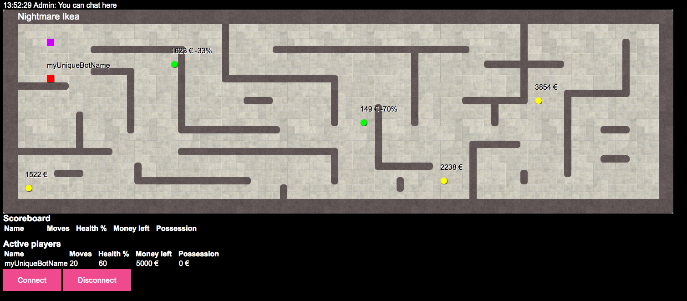

# Bots of black friday

> Shoppers' favorite sale is always the day after Thanksgiving sale, a.k.a. Black Friday.



## Rules of the game

* Bots act as clients. The clients have time until the next tick to register their next move to the server. 
  If they do it more than once, the previous move is overwritten. 
  On next tick the server calculates the next game state, which is accessible from another endpoint.
* Available actions are movement (UP, DOWN, LEFT, RIGHT), picking up an item (PICK) or using one (USE).
* Faulty moves are penalised by decreasing the bot's health.  Dead
  bots are removed from the shop by guards.  Faulty actions include
  running into a wall, trying to pick nonexistent items, etc.
* The items in the shop have a price and a discount percentage.  The
  better the discount, the longer it takes to pick up.
* Every bot has a given amount of money, which is spent on shopping.
* The higher the value of items collected, the better will be the bot's
  position on the top list.
* The "price" of an item is the price *before* discount, so it is *not*
  the amount of money that will actually be spent when you pick it up.
* When items have been collected, new ones are added on the map.
* There's no time limit to exploring the shop, but your health decreases because shopping is hard.
* Because it's Black Friday, some items are weapons that can be used to
  harm the shopper that is the farthest away from the shooter
  (calculated as the manhattan distance between players, and not taking
  into account walls).
* Weapons always hit and cannot be dodged.
* A weapon can only be used once.
* When the bot is out of money, it has to exit the shop by the cash
  register.  After this it is safely out of the game.
* Don't go too early to the cash register.  You won't be able to get
  back.
* The shops may have walls, and traps. Traps cause damage but you can walk through them.

## Creating a bot

``templates/`` directory has two project templates that you can use to get started: One for TypeScript and one for Clojure. Even if you don't end up using either one, it is recommended to look through the TypeScript template to see all the available api calls, their parameters and return types.

### Basic bot usage

First, register your bot:
```json
POST {{url}}/register
Content-Type: application/json

{
    "playerName": "testbot2",
}
```
Note: The response contains the map and an id, which you need to capture and use for the next calls.

Then get the current gamestate:
```
GET {{url}}/gamestate
```

And register your next move:
```
PUT {{url}}/{{playerId}}/move
Content-Type: application/json

"LEFT"
```

The game ticks in 1 second, so your bot needs to wait a second between each move you make.

## Running the server

You can run the server locally for developing your bot. It's not needed though, as you can use the deployed server instance.

### How to start

1. `cd server/`
2. Prepare the frontend: `npm install && npm run-script build`
3. Run the backend: `mvn spring-boot:run`

After this, the GUI can be accessed from http://localhost:8080/


### Admin instructions

The following are only needed for the administrator of the game server.

#### How to create a map?

Copy and paste existing maps, such as the default.map. You need to package and redeploy after adding new maps.

#### How to change the map?

* Changing the map resets the scoreboard and the whole gamestate.
* Use the moderator_api.http-file. Be sure to use the correct environment (add it to the http-client.env.json-file if necessary).

#### How to increase or decrease game speed

Change the GameEngine.PAUSE_BETWEEN_ROUNDS_MILLIS and reboot. The best
value depends on network latency, bot count and bot quality.

#### Developing the server

You can develop the frontend with `npm run watch`.
The backend does not support live reloading, but you can run the app with your IDE, and most IDEs support hot deployment of static resources and Java code.
